# Assaultron ASR-7 - Visual Architecture Guide

A comprehensive visual guide to the Assaultron Project's embodied AI architecture using interactive diagrams.

---

## Multi-Service Architecture

```mermaid
graph TB
    subgraph "run.py - Service Orchestrator"
        RunPy[run.py Launcher]
        Flags{Configuration Flags}
    end

    subgraph "Service 1: Monitoring Dashboard - Port 8081"
        MonDash[monitoring_dashboard.py]
        MonService[monitoring_service.py<br/>MetricsCollector]
        DashUI[Dashboard UI<br/>Live Charts & Stats]
    end

    subgraph "Service 2: Discord Bot - Node.js"
        DiscordBot[discord/bot.js]
        DiscordAPI[Discord API<br/>Gateway Connection]
        SSEListener[SSE Event Listener<br/>/api/voice/events]
        FFmpeg[FFmpeg Converter<br/>WAV → OGG Opus]
    end

    subgraph "Service 3: ASR-7 AI Interface - Port 8080"
        MainApp[main.py<br/>EmbodiedAssaultronCore]
        CognitiveLayer[Cognitive Layer]
        BehavioralLayer[Behavioral Layer]
        VoiceSystem[Voice System]
        VisionSystem[Vision System]
    end

    subgraph "Service 4: Documentation - Port 8000"
        DocsServer[HTTP Server<br/>SimpleHTTPRequestHandler]
        DocsHTML[docs/**/*.html]
    end

    subgraph "External Systems"
        DiscordServers[Discord Servers]
        Webcam[Webcam Device]
        xVAsynth[xVAsynth TTS]
    end

    RunPy --> Flags
    Flags -->|START_MONITORING=True| MonDash
    Flags -->|START_DISCORD_BOT=True| DiscordBot
    Flags -->|START_ASR=True| MainApp
    Flags -->|START_DOCS=True| DocsServer

    MonDash --> MonService
    MonService --> DashUI

    DiscordBot --> DiscordAPI
    DiscordBot --> SSEListener
    DiscordBot --> FFmpeg
    DiscordAPI <--> DiscordServers

    SSEListener --> MainApp
    DiscordBot -->|POST /api/chat| MainApp
    DiscordBot -->|POST /api/monitoring/discord_status| MainApp

    MainApp --> CognitiveLayer
    MainApp --> BehavioralLayer
    MainApp --> VoiceSystem
    MainApp --> VisionSystem
    MainApp -->|Record Metrics| MonService

    VoiceSystem --> xVAsynth
    VisionSystem --> Webcam

    DocsServer --> DocsHTML

    classDef orchestrator fill:#fce4ec,stroke:#c2185b,stroke-width:3px
    classDef service fill:#e3f2fd,stroke:#1565c0,stroke-width:2px
    classDef external fill:#f3e5f5,stroke:#4a148c,stroke-width:2px

    class RunPy,Flags orchestrator
    class MonDash,MonService,DashUI,DiscordBot,MainApp,DocsServer service
    class DiscordServers,Webcam,xVAsynth,DiscordAPI external
```



---

## Monitoring System Architecture


---

## Discord Bot Integration & Voice Messages

```mermaid
sequenceDiagram
    actor DiscordUser
    participant Discord as Discord Servers
    participant Bot as discord/bot.js
    participant SSE as SSE Connection<br/>/api/voice/events
    participant AI as ASR-7 AI Server<br/>Port 8080
    participant xVA as xVAsynth
    participant FFmpeg as FFmpeg Converter
    participant CDN as Discord CDN

    Note over DiscordUser,CDN: Initialization
    Bot->>Discord: Login with DISCORD_BOT_TOKEN
    Discord-->>Bot: Bot online
    Bot->>AI: POST /api/monitoring/discord_status {active: true}

    Note over DiscordUser,CDN: User activates voice via slash command
    DiscordUser->>Discord: /voice activate
    Discord->>Bot: Slash command interaction
    Bot->>AI: POST /api/voice/start
    AI->>xVA: Start xVAsynth server
    xVA-->>AI: Model loaded
    AI-->>Bot: Voice system active
    Bot->>SSE: Connect to /api/voice/events
    Bot->>Discord: ✅ Voice activated! (embed)

    Note over DiscordUser,CDN: Regular chat message
    DiscordUser->>Discord: @ASR-7 Hey there!
    Discord->>Bot: Message event
    Bot->>Bot: Reset notification counter
    Bot->>AI: POST /api/chat {message, source: "discord"}

    AI->>AI: Process message through<br/>Cognitive → Behavioral → Motion
    AI->>AI: Generate dialogue response
    AI->>xVA: Synthesize speech async
    xVA->>xVA: Generate WAV file
    xVA-->>AI: audio_output/response.wav

    AI->>SSE: Emit "audio_ready" event<br/>{filename, url}
    SSE-->>Bot: Event received

    Note over DiscordUser,CDN: Voice message conversion & upload
    Bot->>AI: GET /api/voice/audio/response.wav
    AI-->>Bot: WAV file bytes
    Bot->>Bot: Save temp_voice.wav

    Bot->>FFmpeg: Check ffmpeg availability
    FFmpeg-->>Bot: Available

    Bot->>FFmpeg: Convert WAV → OGG Opus<br/>48kHz, 64k bitrate
    FFmpeg-->>Bot: temp_voice.ogg

    Bot->>FFmpeg: Extract metadata<br/>duration via ffprobe
    FFmpeg-->>Bot: duration, waveform data

    Bot->>Discord: Request upload URL
    Discord-->>Bot: Upload URL + file ID

    Bot->>CDN: PUT upload OGG file
    CDN-->>Bot: Upload complete

    Bot->>Discord: POST message with<br/>IS_VOICE_MESSAGE flag<br/>+ metadata (duration, waveform)
    Discord->>DiscordUser: Voice message appears

    Bot->>Bot: Cleanup temp files

    AI-->>Bot: JSON response {dialogue, states}
    Bot->>Discord: "Hey there!" (text fallback)

    Note over DiscordUser,CDN: LLM provider change
    DiscordUser->>Discord: /llm change gemini
    Discord->>Bot: Slash command
    Bot->>AI: POST /api/settings/provider {provider: "gemini"}
    AI-->>Bot: Provider switched
    Bot->>Discord: ✅ LLM provider: gemini-2.5-flash

    Note over DiscordUser,CDN: Agent task completion broadcast
    AI->>AI: Agent completes task
    AI->>SSE: Emit "agent_completion" event
    SSE-->>Bot: Agent result message
    Bot->>Discord: 🤖 Task complete: [result]
```



---

## System Overview


---

## Message Processing Pipeline


---

## Cognitive Layer Architecture


---

## Behavioral Layer - Utility-Based Selection


---

## Virtual World State Machine


---

## Motion Controller - Symbolic to Hardware Translation


---

## Vision System Pipeline


---

## Autonomous Agent System


---

## Voice System Architecture


---

## Speech-to-Text System Architecture


---

## Notification System Flow


---

## Data Persistence Layer


---

## REST API Endpoint Map


---

## Mood Evolution System


---

## Complete Execution Example: "It's too dark in here"


---

## Technology Stack


---

## Security Architecture


---

## Future Architecture Expansion

```mermaid
graph TB
    subgraph "Current System"
        Current[Virtual Embodied Agent<br/>Software Only]
    end

    subgraph "Phase 1: Physical Hardware"
        Arduino[Arduino/ESP32<br/>Integration]
        RealLED[Physical LEDs<br/>RGB Control]
        RealServos[Servo Motors<br/>Hand Movement]
        HeadMotor[Head Tracking<br/>Pan/Tilt Motors]
    end

    subgraph "Phase 2: Enhanced Vision"
        FaceRec[Face Recognition<br/>Identity Tracking]
        GestureRec[Gesture Recognition<br/>Hand Signals]
        Spatial3D[3D Spatial Tracking<br/>Depth Sensing]
        SceneUnderstanding[Advanced Scene<br/>Understanding]
    end

    subgraph "Phase 3: Advanced Autonomy"
        MultiAgent[Multi-Agent<br/>Collaboration]
        LongTermProjects[Long-Term<br/>Project Tracking]
        SelfImprovement[Self-Improvement<br/>Learning Loop]
        APIIntegration[External API<br/>Integration]
    end

    subgraph "Phase 4: Personalization"
        UserProfiling[User Profile<br/>Learning]
        RelationshipDynamics[Relationship<br/>Milestones]
        ContextSwitching[Multi-Thread<br/>Conversations]
        ProactiveSuggestions[Proactive Task<br/>Suggestions]
    end

    subgraph "Phase 5: Multimodal"
        AudioInput[Speech-to-Text<br/>Voice Commands]
        ImageGen[Image Generation<br/>Visualizations]
        VideoUnderstanding[Video Processing<br/>Complex Scenarios]
    end

    Current --> Arduino
    Arduino --> RealLED
    Arduino --> RealServos
    Arduino --> HeadMotor

    Current --> FaceRec
    FaceRec --> GestureRec
    GestureRec --> Spatial3D
    Spatial3D --> SceneUnderstanding

    Current --> MultiAgent
    MultiAgent --> LongTermProjects
    LongTermProjects --> SelfImprovement
    SelfImprovement --> APIIntegration

    Current --> UserProfiling
    UserProfiling --> RelationshipDynamics
    RelationshipDynamics --> ContextSwitching
    ContextSwitching --> ProactiveSuggestions

    Current --> AudioInput
    AudioInput --> ImageGen
    ImageGen --> VideoUnderstanding

    classDef current fill:#e8f5e9,stroke:#2e7d32,stroke-width:3px
    classDef phase1 fill:#e3f2fd,stroke:#1565c0
    classDef phase2 fill:#f3e5f5,stroke:#4a148c
    classDef phase3 fill:#fff3e0,stroke:#ef6c00
    classDef phase4 fill:#fce4ec,stroke:#c2185b
    classDef phase5 fill:#e0f2f1,stroke:#00695c

    class Current current
    class Arduino,RealLED,RealServos,HeadMotor phase1
    class FaceRec,GestureRec,Spatial3D,SceneUnderstanding phase2
    class MultiAgent,LongTermProjects,SelfImprovement,APIIntegration phase3
    class UserProfiling,RelationshipDynamics,ContextSwitching,ProactiveSuggestions phase4
    class AudioInput,ImageGen,VideoUnderstanding phase5
```

---

## Design Principles Summary

```mermaid
mindmap
  root((Assaultron<br/>ASR-7<br/>Architecture))
    Separation of Concerns
      Cognitive: Goals & Emotions
      Behavioral: Body Commands
      Motion: Hardware Values
      Never Mix Layers

    Symbolic vs Concrete
      Symbolic Above Motion
        Posture.AGGRESSIVE
        Luminance.INTENSE
        HandState.POINTING
      Concrete in Motion Only
        LED Intensity 0-100
        Hand Position 0-100
        Safety Constraints

    Embodiment
      AI Reasons About Intent
        "I want to illuminate"
        "I feel hostile"
        "I need to protect"
      System Translates to Physical
        Auto Body Expression
        No Stage Directions
        Natural Integration

    Personality Consistency
      Sarcastic/Flirty Tone
      Mood Influences Responses
      Memory About Relationships
      Time-Aware Comments
      Character-First Design

    Emergent Behavior
      Mood Evolves Naturally
      Utility-Based Selection
      AI-Judged Memories
      No Hardcoded Rules
      Organic Interactions

    Real-time Integration
      Continuous Vision Updates
      Mood Evolves Over Time
      Async Voice Synthesis
      Proactive Notifications
      Background Monitoring
```

---

## Quick Reference: Component Interactions

| Component | Inputs | Outputs | Primary Responsibility |
|-----------|--------|---------|----------------------|
| **Cognitive Engine** | User message, world state, body state, mood state, vision data, memories | CognitiveState (goal, emotion, dialogue, memory) | High-level reasoning and response generation |
| **Behavior Arbiter** | CognitiveState, current BodyState | BodyCommand (posture, luminance, hands) | Select appropriate behavior based on utility scores |
| **Motion Controller** | BodyCommand | HardwareState (LED intensity, hand positions) | Translate symbolic states to hardware values |
| **Virtual World** | World updates, body commands, user interactions | BodyState, WorldState, MoodState | Maintain agent's internal state representation |
| **Vision System** | Webcam frames | Detected entities, scene description, threat level | Real-time object detection and scene analysis |
| **Voice System** | Text dialogue | WAV audio files, SSE events | Text-to-speech with Fallout 4 Assaultron voice |
| **Agent Logic** | Task description | Task completion result, file artifacts | Autonomous task execution using ReAct pattern |
| **Notification Manager** | Time, threat level, AI flags | Discord webhook messages | Proactive attention requests and alerts |

---

## Configuration Quick Reference

| Setting | Environment Variable | Default | Purpose |
|---------|---------------------|---------|---------|
| **LLM Provider** | `LLM_PROVIDER` | `gemini` | Choose AI backend: ollama/gemini/openrouter |
| **Gemini API** | `GEMINI_API_KEY` | - | Google Gemini API authentication |
| **Voice Model** | `VOICE_MODEL` | `f4_robot_assaultron` | xVAsynth character voice (TTS output) |
| **Mistral API** | `MISTRAL_KEY` | - | Mistral Voxtral STT authentication |
| **STT Sample Rate** | `STT_SAMPLE_RATE` | `16000` | Audio capture sample rate (Hz) |
| **STT Chunk Duration** | `STT_CHUNK_DURATION_MS` | `480` | Audio chunk size (milliseconds) |
| **Vision Confidence** | - | `0.5` | Object detection threshold (runtime config) |
| **Email Enabled** | `EMAIL_ENABLED` | `false` | Enable/disable email functionality |
| **Git Enabled** | `GIT_ENABLED` | `false` | Enable/disable git operations |
| **Discord Webhook** | `DISCORD_WEBHOOK_URL` | - | Notification delivery endpoint |
| **Sandbox Path** | `SANDBOX_PATH` | `./sandbox` | Agent workspace directory |
| **API Auth** | `API_USERNAME`, `API_PASSWORD` | - | Protected endpoint credentials |

---

*This architecture visualization is auto-generated from the ARCHITECTURE.md documentation. For detailed implementation notes, see the full architecture document.*

**Last Updated**: 2026-02-16
**Architecture Version**: 2.1 (Embodied Agent + Multi-Service Infrastructure + Bidirectional Voice I/O)

**New in v2.1** (2026-02-16):
- Added Speech-to-Text System using Mistral Voxtral API for real-time voice input
- Added STT System Architecture sequence diagram showing microphone → transcription flow
- Updated System Overview to include "Input/Output Systems" with both Voice Output (TTS) and Voice Input (STT)
- Added STT endpoints to "Voice & Speech" API map (9 new endpoints)
- Updated Technology Stack with Mistral Voxtral STT and PyAudio components
- Updated Configuration Quick Reference with MISTRAL_KEY, STT_SAMPLE_RATE, STT_CHUNK_DURATION_MS

**New in v2.0.1** (2026-02-13):
- Added Multi-Service Architecture diagram showing all 4 services orchestrated by run.py
- Added Monitoring System Architecture diagram with metrics collection and dashboard
- Added Discord Bot Integration & Voice Messages sequence diagram
- Updated System Overview to include monitoring dashboard and Discord bot integration
