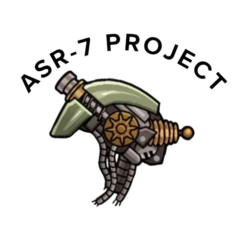

<div align="center">



# Assaultron Project ASR-7
### Autonomous Security Robot - Unit 7


</div>

---

## 🔒 Private Personal Project
This repository hosts the **Assaultron Project ASR-7**, a personal development endeavor focused on creating a fully embodied agent inspired by the Assaultron unit. This code is intended for my own use and future reference.

> **Note to Future Me:** Keep the personality intact. ASR-7 is not just a bot; it's a character. it's asr

---

## 🧠 System Overview
The ASR-7 moves beyond simple chatbot tools into a layered, behavior-based architecture. It doesn't just "chat" it possesses a **Virtual Body** and reasons about its physical state.

### Core Architecture Layers
1.  **Cognitive Layer** (The "Brain"):
    *   Uses **Ollama LLM** with a strict personality prompt.
    *   Outputs a **CognitiveState** (Goal, Emotion, Urgency).
    *   Doesn't know about motors or servos, only intentions.

2.  **Behavioral Layer** (The "Instincts"):
    *   Selects the best behavior based on the cognitive state (e.g., `IntimidateBehavior`, `FriendlyGreetBehavior`).
    *   The "Behavior Arbiter" decides what to do next.

3.  **Virtual Body / World Model** (The "Self"):
    *   Maintains the state of the virtual body (posture, hand positions, luminance).
    *   Tracks the environment (threat levels, entities).

4.  **Motion Layer** (The "Muscles"):
    *   Translates virtual states (`relaxed`, `hostile`) into concrete hardware commands (servo angles, LED PWM).

---

## 📂 Project Structure
```text
AssaultronProject2026/
├── cognitive_layer.py    # LLM & Intent logic
├── behavioral_layer.py   # Behavior selection & Utility
├── virtual_body.py       # Body state definitions
├── motion_controller.py  # Hardware translation
├── voicemanager.py       # TTS & Audio handling
├── hardware_server.py    # Bridge to Arduino/ESP32
├── main.py               # Application entry point (Flask)
├── config.py             # Configuration & Prompts
└── logo.png              # Project Insignia
```

## 🚀 Getting Started

### Prerequisites
*   Python 3.9+
*   Ollama running locally (for the LLM)
*   Virtual environment (recommended)

### Installation
1.  Install dependencies:
    ```bash
    pip install -r requirements.txt
    ```
2.  Ensure Ollama is running and the correct model is pulled.

### Running the Agent
Start the main embodied agent loop:
```bash
python main.py
```

*For more in-depth details on the implementation logic, refer to [`ARCHITECTURE.md`](./ARCHITECTURE.md).*

---
<div align="center">
    <i>"Whatever it is you're looking for, I hope it's worth dying for."</i><br>
    - ASR-7
</div>
