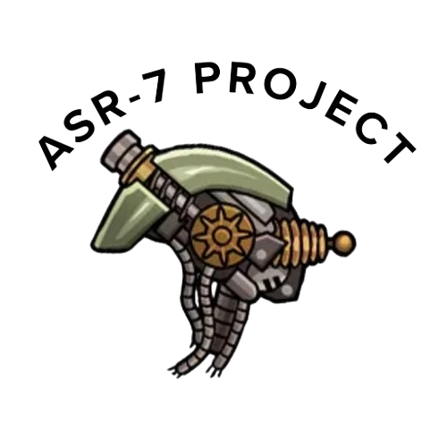

<div align="center">



# Assaultron Project ASR-7
### Autonomous Security Robot - Unit 7

[](https://www.python.org/)
[](https://flask.palletsprojects.com/)
[](https://ollama.ai/)
[](https://www.arduino.cc/)
[](./LICENSE)

*An embodied AI agent with personality, physical awareness, and autonomous behaviors.*

[Features](#-features) •
[Installation](#-installation) •
[Usage](#-usage) •
[Architecture](#-architecture) •
[Contributing](#-contributing) •
[License](#-license)

</div>

---

## 📖 Overview

**Assaultron Project ASR-7** is an advanced embodied AI agent that goes far beyond simple chatbots. Inspired by the Assaultron unit, ASR-7 features a layered, behavior-based architecture that allows it to:

- 🧠 **Think** with intention-based reasoning using LLMs (Ollama, Gemini, or OpenRouter)
- 🎭 **Feel** emotions and express personality through cognitive states
- 🤖 **Embody** a virtual (and optionally physical) body with postures, gestures, and movements
- 👁️ **Perceive** its environment through vision, speech recognition, and sensors
- 🗣️ **Communicate** via text-to-speech with a custom voice model
- 🎯 **Act** autonomously through behavior selection and utility-based decision-making

This is not just a conversational AI, it's a character with a body, emotions, and autonomous agency.

> *"Whatever it is you're looking for, I hope it's worth dying for."* - ASR-7

---

## ✨ Features

### 🧠 Cognitive Architecture
- **Multi-LLM Support**: Ollama (local), Google Gemini, or OpenRouter
- **Intent-Based Reasoning**: AI reasons about goals and emotions, not hardware primitives
- **Personality System**: Consistent character personality with emotional states
- **Memory System**: Core memories, episodic memory, and context awareness
- **Time Awareness**: Understands temporal context and schedules

### 🎭 Behavioral System
- **Behavior Arbiter**: Utility-based behavior selection (Intimidate, Friendly, Patrol, etc.)
- **Virtual Body**: Maintains posture, hand positions, LED states, and physical presence
- **Motion Controller**: Translates cognitive states into hardware commands (servos, LEDs)
- **Gesture System**: Dynamic body language and expressive movements

### 🗣️ Communication
- **Speech-to-Text**: Real-time voice input via Mistral Voxtral
- **Text-to-Speech**: Custom voice synthesis using xVASynth
- **Web Interface**: Flask-based dashboard for monitoring and interaction
- **Discord Integration**: Optional Discord bot for remote interaction

### 👁️ Perception
- **Vision System**: Real-time object detection using TensorFlow Lite
- **Face Detection**: MediaPipe-based face tracking
- **Environment Modeling**: Tracks entities, threat levels, and spatial awareness

### 🛠️ Tools & Integrations
- **Email Management**: Send/receive emails autonomously
- **GitHub Integration**: Commit, push, and manage repositories
- **Task Detection**: Identify and track TODO items in conversations
- **Sandbox Environment**: Safe code execution environment
- **Monitoring Dashboard**: Real-time performance and state visualization

### 🔧 Hardware Support
- **ESP32/Arduino**: Servo control for physical embodiment
- **LED Control**: Dynamic lighting for emotional expression
- **Serial Communication**: Hardware bridge for real-time control

---

## 🚀 Installation

### Prerequisites

- **Python 3.9+** (tested on 3.9-3.11)
- **LLM Backend** (choose one):
  - [Ollama](https://ollama.ai/) (recommended for local/offline use)
  - Google Gemini API key
  - OpenRouter API key
- **Audio** (optional, for voice features):
  - PyAudio-compatible system
  - xVASynth for TTS
- **Hardware** (optional):
  - ESP32 or Arduino board
  - Servo motors and LEDs

### Quick Start

1. **Clone the repository**
   ```bash
   git clone https://github.com/CamoLover/AssaultronProject.git
   cd AssaultronProject
   ```

2. **Create a virtual environment**
   ```bash
   python -m venv venv
   source venv/bin/activate  # On Windows: venv\Scripts\activate
   ```

3. **Install dependencies**
   ```bash
   pip install -r requirements.txt
   ```

4. **Configure environment variables**
   ```bash
   cp .env.example .env
   # Edit .env with your API keys and preferences
   ```

5. **Start Ollama** (if using local LLM)
   ```bash
   ollama pull gemma3:4b
   ollama serve
   ```

6. **Run the agent**
   ```bash
   python main.py
   ```

7. **Access the web interface**
   - Open your browser to `http://localhost:8080`
   - Default credentials: `admin` / `your_secure_password_here` (set in `.env`)

---

## 🎮 Usage

### Basic Interaction

Once running, you can interact with ASR-7 through:

1. **Web Interface** (`http://localhost:8080`)
   - Chat interface with real-time responses
   - View current cognitive state, emotions, and body posture
   - Monitor system metrics and logs

2. **Voice Interaction** (if configured)
   - Enable STT in the web interface
   - Speak directly to ASR-7
   - Hear responses via TTS

3. **Discord Bot** (if configured)
   - Interact from Discord servers
   - Use commands and conversational queries


### Advanced Usage

**Memory Management**:
```python
# Access via web interface or API
POST /api/memory/core
{
  "memory": "User prefers direct communication",
  "importance": 8
}
```

**Custom Behaviors**:
- Add new behaviors in `src/behavioral_layer.py`
- Implement behavior utilities and execution logic
- Behaviors are automatically selected based on cognitive state

**Hardware Integration**:
- Configure servo mappings in `src/motion_controller.py`
- Connect ESP32/Arduino via serial
- Physical body movements mirror virtual body state

---

## 🏗️ Architecture

ASR-7 uses a **layered architecture** inspired by robotics and cognitive science:

```
┌─────────────────────────────────────────────────────────┐
│                  COGNITIVE LAYER                        │
│  • LLM reasoning (Ollama/Gemini/OpenRouter)             │
│  • Outputs: CognitiveState (Goal, Emotion, Urgency)     │
│  • No hardware knowledge only intentions                │
└─────────────────────┬───────────────────────────────────┘
                      │
┌─────────────────────▼───────────────────────────────────┐
│                  BEHAVIORAL LAYER                       │
│  • Behavior Arbiter (utility-based selection)           │
│  • Behaviors: Intimidate, Friendly, Patrol, Curious     │
│  • Selects best action based on cognitive state         │
└─────────────────────┬───────────────────────────────────┘
                      │
┌─────────────────────▼───────────────────────────────────┐
│              VIRTUAL BODY / WORLD MODEL                 │
│  • Body state: posture, hands, LEDs, luminance          │
│  • Environment: entities, threats, spatial awareness    │
│  • Self-model: physical and emotional state             │
└─────────────────────┬───────────────────────────────────┘
                      │
┌─────────────────────▼───────────────────────────────────┐
│                   MOTION LAYER                          │
│  • Translates virtual states → hardware commands        │
│  • Servo angles, LED PWM, physical movements            │
│  • Hardware abstraction layer                           │
└─────────────────────────────────────────────────────────┘
```

### Key Components

| Module | Purpose |
|--------|---------|
| `main.py` | Flask server, web interface, main loop |
| `src/cognitive_layer.py` | LLM interface, intent reasoning, CognitiveState |
| `src/behavioral_layer.py` | Behavior selection, utility arbiter, action execution |
| `src/virtual_body.py` | Virtual body state, postures, world model |
| `src/motion_controller.py` | Hardware translation, servo/LED control |
| `src/voicemanager.py` | TTS/audio generation and playback |
| `src/stt_manager.py` | Speech-to-text (Mistral Voxtral) |
| `src/vision_system.py` | Object detection, face tracking |
| `src/agent_tools.py` | Tool system (email, git, web search, etc.) |
| `src/monitoring_service.py` | Performance metrics, system monitoring |

For detailed implementation notes, see [`docs/ARCHITECTURE.md`](./docs/ARCHITECTURE.md).

---

## 📂 Project Structure

```
AssaultronProject/
├── src/
│   ├── cognitive_layer.py      # LLM & intent reasoning
│   ├── behavioral_layer.py     # Behavior selection & arbiter
│   ├── virtual_body.py         # Virtual body state
│   ├── motion_controller.py    # Hardware translation
│   ├── voicemanager.py         # TTS engine
│   ├── stt_manager.py          # Speech-to-text
│   ├── vision_system.py        # Computer vision
│   ├── agent_tools.py          # Tool implementations
│   ├── agent_logic.py          # Agent orchestration
│   ├── config.py               # Configuration & prompts
│   ├── email_manager.py        # Email integration
│   ├── git_manager.py          # GitHub integration
│   ├── sandbox_manager.py      # Safe code execution
│   ├── monitoring_service.py   # System monitoring
│   ├── templates/              # Web UI templates
│   └── discord/                # Discord bot integration
├── ai-data/
│   ├── core_memories/          # Persistent memory storage
│   └── context/                # Conversation context
├── Content/
│   └── xVAsynth/               # Voice synthesis models
├── docs/                       # Documentation
├── main.py                     # Application entry point
├── run.py                      # Quick launcher
├── requirements.txt            # Python dependencies
├── .env.example                # Environment template
└── LICENSE                     # MIT License

```

---

## 🤝 Contributing

Contributions are welcome! Whether you want to add new behaviors, improve existing systems, or fix bugs, your help is appreciated.

### How to Contribute

1. **Fork the repository**
   ```bash
   git fork https://github.com/CamoLover/AssaultronProject.git
   ```

2. **Create a feature branch**
   ```bash
   git checkout -b feature/amazing-new-behavior
   ```

3. **Make your changes**
   - Follow existing code style
   - Add comments for complex logic
   - Update documentation if needed

4. **Test your changes**
   ```bash
   python main.py  # Ensure the agent still runs
   # Test your specific feature thoroughly
   ```

5. **Commit your changes**
   ```bash
   git add .
   git commit -m "feat: add amazing new behavior"
   ```

6. **Push and create a Pull Request**
   ```bash
   git push origin feature/amazing-new-behavior
   ```

### Contribution Guidelines

- **Code Quality**: Keep code clean, readable, and well-documented
- **Modularity**: Follow the layered architecture pattern
- **Character Consistency**: Maintain ASR-7's personality and character
- **Testing**: Test changes thoroughly before submitting
- **Documentation**: Update README/docs for significant changes

### Areas for Contribution

- 🆕 **New Behaviors**: Add behaviors to the behavioral layer
- 🎨 **UI Improvements**: Enhance the web dashboard
- 🔧 **Hardware Support**: Update and make new hardware integrations
- 🧠 **LLM Providers**: Support additional LLM backends
- 🌍 **Localization**: Multi-language support
- 📚 **Documentation**: Improve guides and tutorials
- 🐛 **Bug Fixes**: Fix issues and improve stability

---

## 🐛 Troubleshooting

### Common Issues

**LLM Connection Errors**
```bash
# Ensure Ollama is running (if using local)
ollama serve

# Check if model is pulled
ollama list
ollama pull gemma3:4b
```

**Audio/Voice Issues**
```bash
# Install PyAudio dependencies (Ubuntu/Debian)
sudo apt-get install portaudio19-dev python3-pyaudio

# Windows: Download PyAudio wheel
pip install pipwin
pipwin install pyaudio
```

**Permission Errors**
```bash
# Ensure proper file permissions
chmod +x run.py
```

**Port Already in Use**
```bash
# Change Flask port in main.py or .env
# Default is 8080
```

---

## 📜 License

This project is licensed under the **MIT License** - see the [LICENSE](LICENSE) file for details.

```
Copyright (c) 2026 Evan Escabasse.

Permission is hereby granted, free of charge, to any person obtaining a copy
of this software and associated documentation files (the "Software"), to deal
in the Software without restriction...
```

---

## 🙏 Acknowledgments

- **Ollama** for local LLM inference
- **Google Gemini** for advanced reasoning capabilities
- **Mistral AI** for speech-to-text (Voxtral) & Mistral Large 3 for LLM via Openrouter
- **[xVASynth](https://github.com/DanRuta/xVA-Synth)** for character voice synthesis
- **MediaPipe** for face detection
- **TensorFlow** for object detection
- The **open-source community** for invaluable tools and libraries

---

## 📞 Contact & Support

- **Issues**: [GitHub Issues](https://github.com/CamoLover/AssaultronProject/issues)
- **Discussions**: [GitHub Discussions](https://github.com/CamoLover/AssaultronProject/discussions)

---

<div align="center">

## Star History

[](https://www.star-history.com/?repos=CamoLover%2FAssaultronProject&type=date&legend=top-left)

### ⚡ Built with passion for embodied AI ⚡

*"Keep the personality intact. ASR-7 is not just a bot; it's a character."*

**[⬆ Back to Top](#assaultron-project-asr-7)**

</div>
